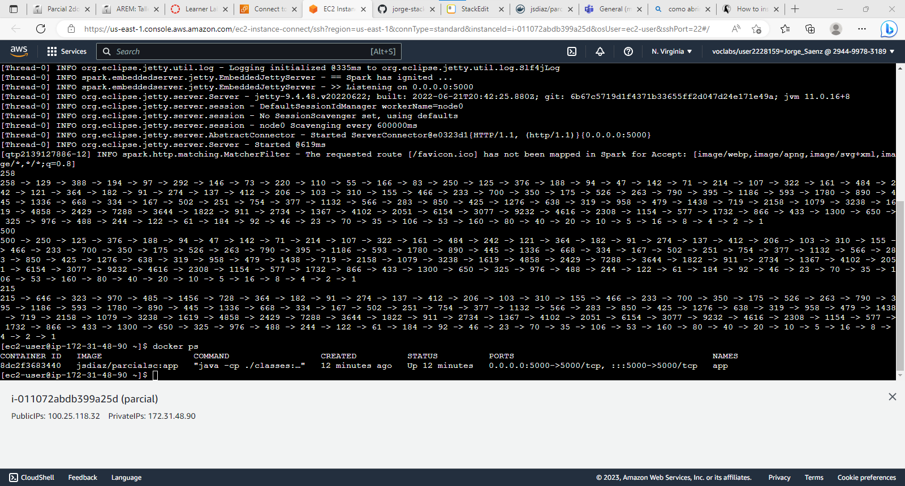

#  Parcial 2: Arquitecturas Empresariales

Diseña, construye y despliegua una aplicación web para investigar la conjetura de Collatz. El programa debe esta desplegado en un microcontenedor Docker corriendo en AWS.

---

###  Prerrequisitos

Para elaborar este proyecto requerimos de las siguientes tecnologías:

- **[Maven](https://openwebinars.net/blog/que-es-apache-maven/)**: Apache Maven es una herramienta que estandariza la configuración de un proyecto en todo su ciclo de vida.

- **[Git](https://learn.microsoft.com/es-es/devops/develop/git/what-is-git)**: Es un sistema de control de versiones distribuido (VCS).

- **[Docker](https://www.ibm.com/co-es/topics/docker)**: Docker es una plataforma de código abierto de contenedorización . Permite a los desarrolladores empaquetar aplicaciones en contenedores, componentes ejecutables estandarizados que combinan el código fuente de la aplicación con las bibliotecas del sistema operativo (SO) y las dependencias necesarias para ejecutar ese código en cualquier entorno.

---

###  Instalación
Primero clonamos el repositorio

git clone https://github.com/jorge-stack/Parcial-2.git

Se accede al repositorio que acabamos de clonar

cd Parcial-2

En nuestra instancia EC2 nos aseguramos de tener Docker installado
	
	sudo yum update -y  
	sudo yum install docker

Posteriormente configuramos que arranque docker al iniciar la instancia

	sudo service docker start

Ahora configuramos el usuario de la instancia con los permisos necesarios. Cerramos la instancia y volvemos a entrar para hacer efectivo este cambio

	sudo usermod -a -G docker ec2-user

---

###  Run
Para correr el servicio corremos el siguiente comando

	docker run -d -p 5000:5000 --name app jsdiaz/parcialsc:app

Esto correrá nuestro contenedor trayendo la imagen del [Dockehub]([jsdiaz/parcialsc general | Docker Hub](https://hub.docker.com/repository/docker/jsdiaz/parcialsc/general)), expondra el puerto 5000 del contenedor en el puerto 5000 de la instancia. En mi caso queda el acceso en la siguiente url:

	http://ec2-100-25-118-32.compute-1.amazonaws.com:5000/

Un [video](https://pruebacorreoescuelaingeduco.sharepoint.com/sites/me195/Shared%20Documents/General/Recordings/New%20channel%20meeting-20230331_152514-Meeting%20Recording.mp4?web=1) de muestra del funcionamiento.

---

##  Construido con

* **[Maven](https://maven.apache.org/)**: Apache Maven es una herramienta que estandariza la configuración de un proyecto en todo su ciclo de vida.

* **[Git](https://rometools.github.io/rome/)**: Es un sistema de control de versiones distribuido (VCS).

* **[IntelliJ](https://www.jetbrains.com/idea/)**: Es un entorno de desarrollo integrado para el desarrollo de programas informáticos.

* **[Java 11](https://www.java.com/es/)**: Lenguaje de programación de propósito general, es decir, que sirve para muchas cosas, para web, servidores, aplicaciones móviles, entre otros. Java también es un lenguaje orientado a objetos, y con un fuerte tipado de variables.

* **[Html](https://developer.mozilla.org/es/docs/Learn/Getting_started_with_the_web/HTML_basics)**: Es el código que se utiliza para estructurar y desplegar una página web y sus contenidos.

* **[JavaScript](https://developer.mozilla.org/es/docs/Learn/JavaScript/First_steps/What_is_JavaScript)**: JavaScript es un lenguaje de programación o de secuencias de comandos que te permite implementar funciones complejas en páginas web

* **[Sparkjava](https://sparkjava.com/)**: Spark es un marco de aplicación web de software libre y de código abierto y un lenguaje específico de dominio escrito en Java.

* **[Docker](https://www.ibm.com/co-es/topics/docker)**: Docker es una plataforma de código abierto de contenedorización . Permite a los desarrolladores empaquetar aplicaciones en contenedores, componentes ejecutables estandarizados que combinan el código fuente de la aplicación con las bibliotecas del sistema operativo (SO) y las dependencias necesarias para ejecutar ese código en cualquier entorno.

##  Autor

* **[Jorge David Saenz Diaz](https://co.linkedin.com/in/jorgedsaenzd/en)** - [Jorge-Stack](https://github.com/jorge-stack?tab=repositories)

##  Licencia

**©** Jorge David Saenz Diaz, Estudiante de Ingeniería de Sistemas de la Escuela Colombiana de Ingeniería Julio Garavito.
